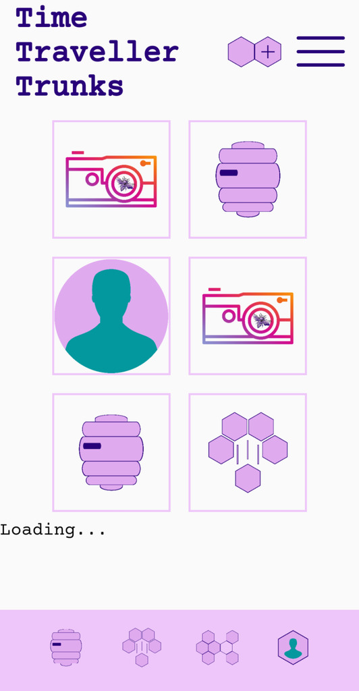
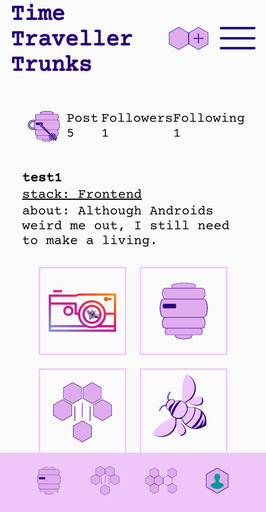
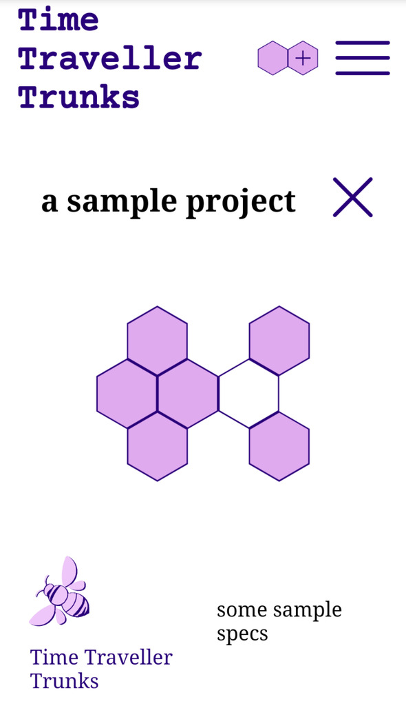
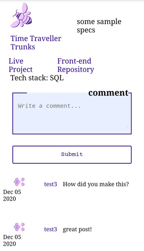
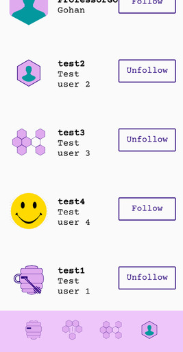
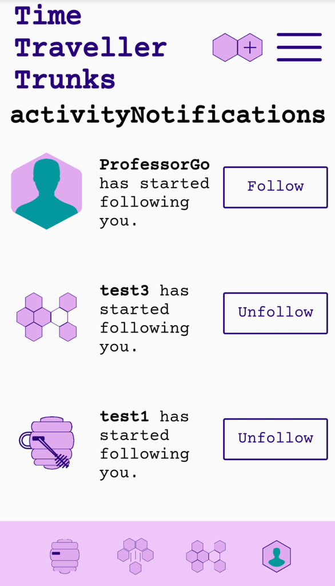

# [Init](https://init-rachel.vercel.app/) API

`Init` is a social media site for developers to connect over their work. Users can upload posts with images that are stored in our database. These posts appear in the feed of users that are following you and can also be viewed on your portfolio page. You can interact with other users by commenting on their posts or by following their future posts.

This is a repository for the `Init API`.

View the live version [here](https://init-rachel.vercel.app/)

View the repository for the client [here](https://github.com/rachanastasia/init-client).

To test `Init`, create a new account or log in with these credentials:
username: `testuser`
password: `ssRAGE2!`

`Init` was created by [Adyceum Magna Ccarri](https://github.com/i-MCcarri), [Rachel Reilly](https://github.com/Rachanastasia), [Steven Henderson](https://github.com/Hendoe), and [Trevor J Alt](https://github.com/trevorjalt).

## Tech Stack

- Node.js with Express
- PostgreSQL with Knex.js
- Mocha, Chai, SuperTest
- JWT Authentication
- deployed with Heroku

## Features

### Infinite scroll through your feed

### Infinite scroll through profiles

### View expanded version of posts

#### Write and see comments in expanded view

### Follow and unfollow users

### Get notifications when other users follow you or comment on your posts

## API Endpoints

### /api/auth

### /api/avatar

- requires auth token

### /api/user

#### POST /api/user

#### GET /api/user

Not accessable through API

#### GET /api/user/user/:user_id

### /api/follow

- requires auth token

#### GET /api/follow

Get all users that are following the logged in user and all of the users which the logged in user is following.

- requires auth token

#### POST /api/follow

Adds follower to current user's followers

- requires auth token

#### DELETE /api/follow

Removes follower from current user's followers

- requires auth token

### /api/post

- requires auth token

### /api/comment

- requires auth token

#### GET /api/comment/:post_id

Get all comments for a specific post by id.

- requires auth token

#### POST /api/comment/:post_id

Add a comment to the post with the specific id. This returns an array of all comments for the post.

- requires auth token
